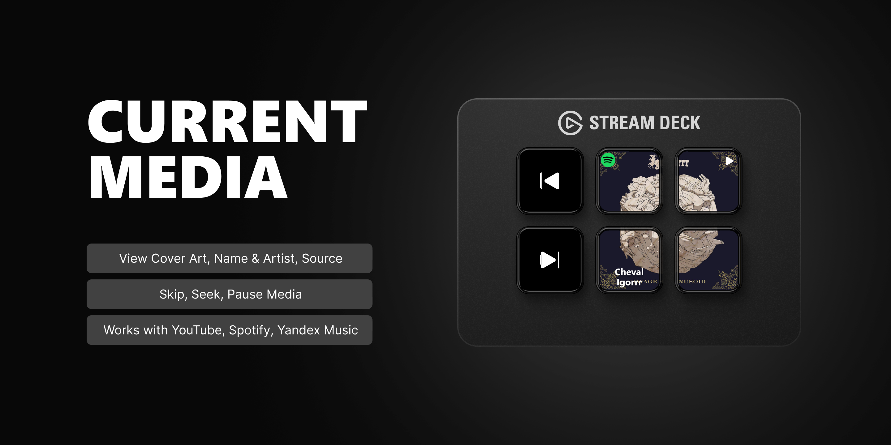

[English](README.md) | Русский | [中文](README.zh-CN.md)

# Current Media (Now Playing)

Плагин для Stream Deck, который отображает информацию о текущем воспроизводимом медиа из различных приложений и предоставляет расширенные элементы управления воспроизведением.

## Возможности

- **Динамическое отображение**: Показывает обложку, название и исполнителя, также показывается приложение: Spotify, Chrome и т.д.
- **Режим большой обложки**: Объедините сетку клавиш 2x2 для отображения одной большой обложки.
- **Элементы управления воспроизведением**: Специальные действия для Воспроизведения/Паузы, Следующего и Предыдущего трека.
- **Функциональность перемотки**: Действия для перемотки вперед/назад.
- **Все можно настроить**: Что делать при нажатии, отображать ли источник медиа, название или исполнителя и т.д.
- **Кроссплатформенность**: Доступен на Windows и macOS.
- **Широкая совместимость**: Работает со Spotify, Chrome, Yandex Music, Apple Music и другими приложениями, которые интегрируются с системными медиа-контролами в Windows (SMTC) и macOS.

## Требования

- **Программное обеспечение Elgato Stream Deck**: Версия 6.9 или выше
- **Операционная система**:
  - Windows 10 или выше
  - macOS 10.15 или выше

## Ручная установка

1. Скачайте последнюю версию со страницы [Releases](https://github.com/valentderah/stream-deck-current-media/releases).
2. Дважды щелкните по скачанному файлу `.streamDeckPlugin` для установки.

## Плагин в магазине Elgato
https://marketplace.elgato.com/product/current-media-now-playing-a7ff3537-f6df-43f1-b3d0-35bd9f24078c
