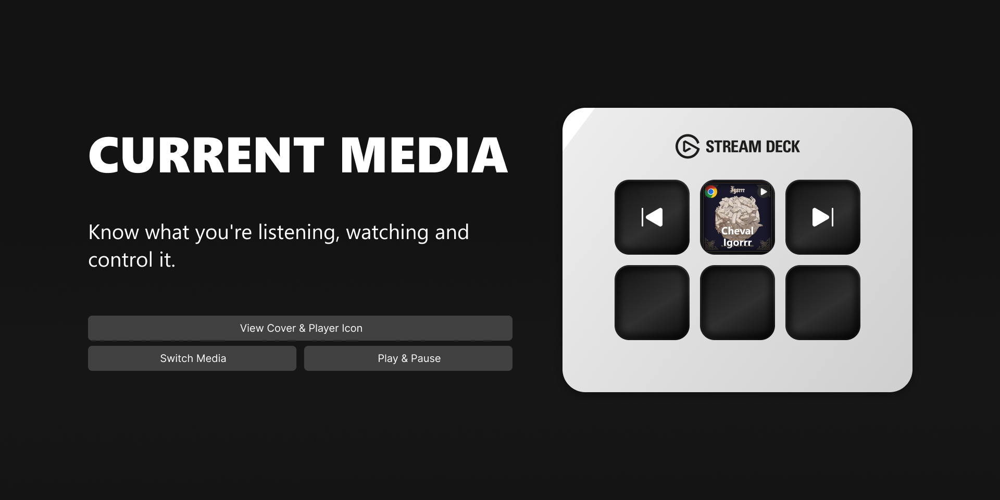

[English](README.md) | [Русский](README.ru.md) | 中文

# Current Media (Now Playing)

一款 Stream Deck 插件，可显示来自各种来源的当前播放媒体信息，并提供高级播放控制功能。

## 功能

- **动态显示**：显示封面、标题和艺术家，以及来源：Spotify、Chrome 等。
- **大封面模式**：将 2x2 按键网格组合，显示一张大封面图片。
- **播放控制**：提供播放/暂停、下一曲和上一曲的专用操作。
- **快进快退**：支持向前/向后快进快退。
- **完全可自定义**：配置按键按下时的操作、是否显示媒体来源、标题或艺术家等。
- **广泛兼容**：支持任何集成了系统媒体传输控件 (SMTC) 的应用程序（如 Spotify、Chrome、Yandex Music）。

## 系统要求

- **Elgato Stream Deck 软件**：6.9 或更高版本
- **操作系统**：Windows 10 或更高版本

## 手动安装

1. 从 [Releases](https://github.com/valentderah/stream-deck-current-media/releases) 页面下载最新版本。
2. 双击下载的 `.streamDeckPlugin` 文件进行安装。

## 商店中的插件
https://marketplace.elgato.com/product/current-media-now-playing-a7ff3537-f6df-43f1-b3d0-35bd9f24078c
