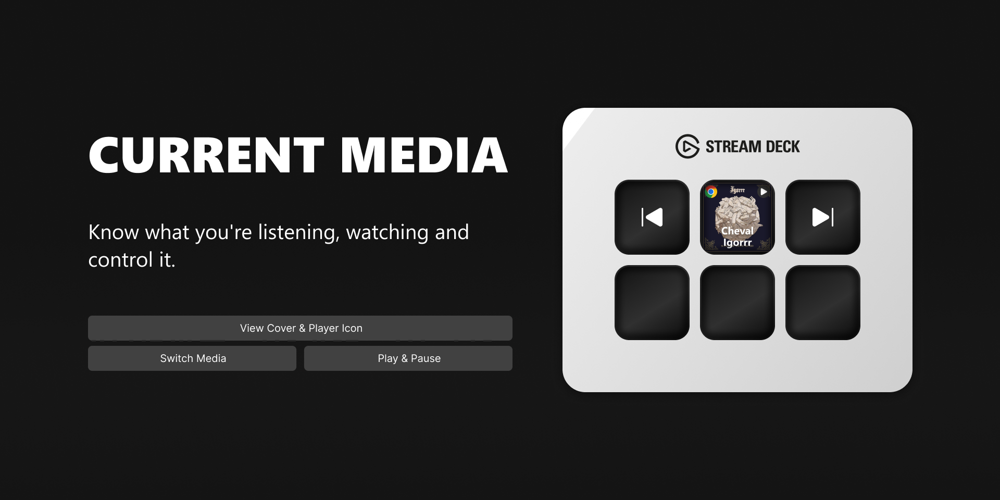

[English](README.md) | [Русский](README.ru.md) | 中文

# 当前媒体（Now Playing）

一款 Stream Deck 插件，用于显示来自各种来源的当前播放媒体信息，并提供高级播放控制功能。

## 功能

- **动态显示**：显示封面、标题和艺人信息，以及来源（Spotify、Chrome 等）。
- **大封面模式**：组合 2x2 键位网格以显示单张大封面图片。
- **播放控制**：提供播放/暂停、下一首和上一首曲目的专用操作。
- **快进/快退功能**：支持快进和快退操作。
- **完全可自定义**：可配置按键触发动作，包括是否显示媒体来源、标题或艺人等信息。
- **广泛兼容性**：支持任何集成 System Media Transport Controls (SMTC) 的应用程序（例如 Spotify、Chrome、Yandex Music）。

## 系统要求

- **Elgato Stream Deck 软件**：6.9 版或更高版本
- **操作系统**：Windows 10 或更高版本

## 手动安装

1. 从 [发布](https://github.com/valentderah/stream-deck-current-media/releases) 页面下载最新版本。
2. 双击下载的 `.streamDeckPlugin` 文件进行安装。

## 应用商店中的插件
https://marketplace.elgato.com/product/current-media-now-playing-a7ff3537-f6df-43f1-b3d0-35bd9f24078c
